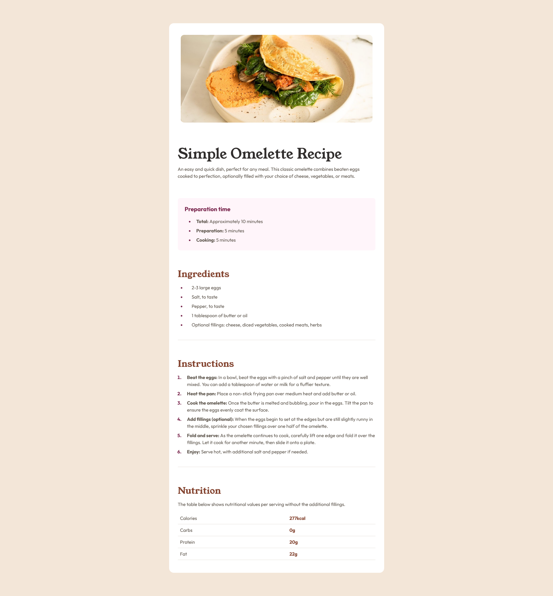

# Frontend Mentor - Recipe page solution

This is a solution to the [Recipe page challenge on Frontend Mentor](https://www.frontendmentor.io/challenges/recipe-page-KiTsR8QQKm). Frontend Mentor challenges help you improve your coding skills by building realistic projects.

## Table of contents

- [Overview](#overview)
  - [The challenge](#the-challenge)
  - [Screenshot](#screenshot)
  - [Links](#links)
- [My process](#my-process)
  - [Built with](#built-with)
  - [What I learned](#what-i-learned)
  - [Continued development](#continued-development)
  - [Useful resources](#useful-resources)
- [Author](#author)
- [Acknowledgments](#acknowledgments)

## Overview

### Screenshot

### Links

- Solution URL: [Frontend Mentor](https://www.frontendmentor.io/solutions/responsive-recipe-page-using-html-and-tailwind-css-LmpWO_OYjE)
- Live Site URL: [Github Pages](https://bccpadge.github.io/recipe-page-main/)

## My process

### Built with

  
  

### What I learned

I learned how to style the counters or bullets using the `marker` modifier in Tailwind CSS.

### Continued development

When I decided to build this project, I was going to use HTML and CSS but I couldn't wtite good CSS class names. So, I used Tailwind CSS and probably going to use it in future projects as well.

### Useful resource

- [Tailwind CSS](https://tailwindcss.com/) - Tailwind CSS Docs

## Author

  
  
  
  

## Acknowledgments

I used this solution as inspiration - [Recipe Page using Vite+Tailwind](https://www.frontendmentor.io/solutions/recipe-page-using-vitetailwind-hD3huuJAhY)
